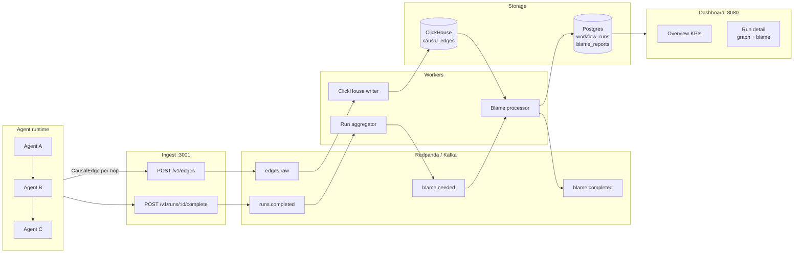
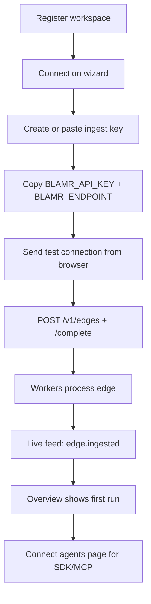

# Causal monitoring — how it works

This document explains **blamr's causal monitoring pipeline**: what gets measured at each agent handoff, how runs are scored and classified, how blame is computed, and how the dashboard turns that into operational signals.

For field-level reference on `CausalEdge` and configuration knobs, see [CONCEPTS.md](./CONCEPTS.md). For install and SDK usage, see [INSTALL.md](./INSTALL.md).

**Web version:** [marketing-site/causal-monitoring.html](../marketing-site/causal-monitoring.html) (also served at `/causal-monitoring.html` on the dashboard host).

---

## What causal monitoring is

Traditional tracing answers: *what happened, in what order, and how long did it take?*

Causal monitoring answers: **which agent introduced the fault, and why did the workflow fail?**

blamr does this by recording a **CausalEdge** at every agent handoff — not just latency and tokens, but:

| Signal | Business meaning |
|--------|------------------|
| `confidence_in` / `confidence_out` | How certain the receiving agent was going in vs going out |
| `intent_delta` | Whether the hop preserved the workflow goal (−1 = total drift, 0 = preserved) |
| `influence_score` | How much downstream behavior this hop can affect |
| I/O previews | Truncated input/output for trace UI, embeddings, and LLM explanations |

Those signals form a **directed causal graph** per run. When the run completes, workers walk that graph backward and assign **fault-weighted blame percentages** to each agent.

---

## End-to-end pipeline



### Step-by-step

1. **Instrument** — SDK, MCP proxy, or framework adapter emits one `CausalEdge` per hop (`from_agent → to_agent`).
2. **Ingest** — Validates API key + rate limit, Merkle-hashes edges, publishes to `edges.raw`. Returns `202 Accepted` immediately (non-blocking for agents).
3. **Edge writer** — Batches edges into ClickHouse; optionally runs first-pass semantic drift enrichment.
4. **Complete run** — Agent calls `POST /v1/runs/:run_id/complete` with `success` or `failed` (+ optional error summary and confidence gate hints).
5. **Run aggregator** — Waits a configurable settle period (`BLAMR_SEMANTIC_SETTLE_MS`, default 2s) so late edges land, then publishes `blame.needed`.
6. **Blame processor** — Loads all edges for the run, enriches signals, evaluates confidence gate, computes blame, optionally fuses ML + LLM reasons, persists to Postgres.
7. **Dashboard** — API serves runs and blame reports; UI renders causal graph, trace, cost, and blame/attribution tabs.

**Important:** Agents talk to **ingest** (`:3001`). The dashboard API (`:3000`) is read/auth only for operators. The dashboard can also POST a **test edge** directly to ingest during onboarding (browser CORS on ingest).

---

## Agent onboarding flow (dashboard)

New workspaces get a guided path from signup to first visible run without external docs:



| Component | Location | Role |
|-----------|----------|------|
| `AgentConnectionWizard` | Dashboard modal | 4-step key → env → test → success |
| `apps/web/src/config.ts` | Web build | `INGEST_ENDPOINT` from `VITE_INGEST_URL` |
| `apps/web/src/api/ingest.ts` | Web client | `sendOnboardingTestEdge()` — browser test ping |
| `scripts/verify-agent-connection.sh` | Host CLI | Same test edge for docs/CI |
| Connect page (`#/connect`) | Dashboard | Dynamic ingest URL + `blamrTrace` quick start |

Onboarding completes when the test edge succeeds **or** the user chooses **I'll connect later** (stored per workspace in localStorage). The wizard reopens while `executions.total === 0`.

---

## The unit of observation: CausalEdge

Each edge is one **handoff** in a multi-agent workflow:

```
Agent A  ──edge──►  Agent B
         hop_index: 0
         confidence_in:  what B received with
         confidence_out: what B emitted
         intent_delta:   goal preservation on this hop
         influence_score: downstream causal weight
```

Edges are ordered by `hop_index` and linked into an audit chain via `prev_hash` → `edge_hash` (SHA-256).

### Agent-side signal computation

Before ingest, the TypeScript SDK (`@blamr/sdk`) computes hop signals via `computeHopSignals()`:

1. **Intent delta** — from domain alignment, retrieval relevance, or explicit value  
   - Aligned domains → ~−0.02 (goal preserved)  
   - Weak retrieval → −0.15 to −0.35 (goal drift)

2. **Confidence out** — composite of:
   - Lexical confidence in LLM text
   - Structured JSON `confidence` fields
   - Tool/MCP scores
   - **Alignment ceiling** — high confidence is capped when intent drifted
   - Upstream cap — cannot exceed prior hop's confidence without justification

This means agents don't need to manually guess blame; they emit honest I/O + scores, and the platform derives causal primitives.

---

## Run lifecycle and status

A **WorkflowRun** spans all edges sharing a `run_id`.

| Phase | Status | What the dashboard shows |
|-------|--------|--------------------------|
| Hops in flight | *(no row yet)* | Edges stream to ClickHouse |
| `completeRun()` called | `running` → processing | Poll until blame ready |
| Blame processor finishes | `success` or `failed` | Full run detail available |

### Business failure vs confidence gate failure

Two independent failure mechanisms exist:

| Source | Who decides | Example |
|--------|-------------|---------|
| **Business rule** | Agent calls `completeRun({ businessFailed: true })` | Tool threw, validation failed |
| **Confidence gate** | Workers re-evaluate after enrichment | Final hop confidence 62% < 70% threshold |

If the agent reports `success` but the confidence gate fails, workers **upgrade the run to `failed`** and set `error_summary` from the gate reason.

### Confidence gate modes

Configured per workflow (SDK, or **Settings → Workspace → Workflow profiles**):

| Mode | Pass condition | Use when |
|------|----------------|----------|
| `final` (default) | Last hop's `confidence_out` ≥ accept level | End-to-end output quality matters |
| `min` | **Every** hop's `confidence_out` ≥ accept level | No weak link allowed in chain |

Default accept level: **0.70** (`DEFAULT_CONFIDENCE_ACCEPT_LEVEL`).

After semantic/ML enrichment, workers call `reconcileEdgeConfidenceChain()` so each hop's `confidence_in` equals the minimum `confidence_out` of its upstream predecessors (supports linear, fork, and join topologies).

---

## Post-run enrichment (workers)

Before blame is computed, workers enrich raw agent telemetry.

### 1. Semantic drift (optional, `BLAMR_SEMANTIC_DRIFT=true`)

Embeds I/O previews via local Ollama (`nomic-embed-text` by default):

- **Tool/MCP hops** — compare input preview vs output preview (e.g. leave request → payroll policy)
- **Downstream hops** — compare run goal (first hop input) vs output

Merge rule (telemetry-first mode, default):

- `intent_delta = min(agent_reported, semantic_value)`
- `confidence_out = min(reported, semantic_similarity_ceiling)`

Agent-reported values stay authoritative unless semantic analysis finds stronger drift.

### 2. ML drift + ranker (optional, `BLAMR_ML_ENABLED=true`)

Models in `packages/ml/models/` classify each hop:

| Drift type | Business meaning |
|------------|------------------|
| `domain_mismatch` | Output belongs to wrong domain |
| `retrieval_miss` | KB/tool returned irrelevant data |
| `severity_underrate` | Incident severity too low |
| `confidence_inflation` | Agent overconfident despite downstream fault |
| `propagation` | Echoing an upstream error |

ML can **boost `influence_score`** on high-drift hops before blame weighting.

---

## Accuracy score (run-level KPI)

Each completed run gets an `accuracy_score` (0–1) used for workflow health bands and Overview metrics.

Logic (`apps/workers/src/compute-blame.ts`):

```
if no edges:
  success → 0.9
  failed  → 0.4
else:
  base = last_hop.confidence_out
  if success: clamp(base, 0.65 … 0.99)
  if failed:  clamp(base × 0.55, 0.25 … 0.65)
```

**Interpretation:** accuracy reflects **final-hop confidence tempered by outcome**. A failed run with high last-hop confidence still scores lower because the outcome failed.

---

## Blame attribution (core business logic)

Blame answers: *of the total fault in this run, what fraction belongs to each agent?*

### Fault signals per hop

For each edge, workers compute three local fault signals:

| Signal | Formula | Meaning |
|--------|---------|---------|
| **Intent harm** | `max(0, −intent_delta)` | Goal drift introduced on this hop |
| **Confidence drop** | `max(0, confidence_in − confidence_out)` | Agent lost certainty — often mismatch |
| **Inflation** | `max(0, confidence_out − confidence_in − 0.15)` | Overconfident despite problems |

The **0.15 inflation threshold** is configurable in the dashboard via workspace settings (`buildRunDetail` uses workspace override when present).

### Blame weights

For each hop, a raw weight is assigned to `from_agent` (the agent that *produced* the handoff):

```
localFault = intentHarm × 3 + confDrop × 2 + inflation × 2

if run failed:
  weight = influence_score × (localFault + 0.05)
else:
  weight = influence_score × 0.5   // influence, not fault
```

Weights are summed per agent, normalized to **percentages** (sum = 100%).

**Design principle:** blame follows **where fault was introduced**, not hop order alone or raw token count.

### Root cause selection

On **failed** runs:

- Agents sorted by blame % descending
- Top agent marked `is_root = true`
- Human-readable `reason` generated from dominant fault signal (drift, drop, inflation)

On **successful** runs:

- Same math produces an **influence distribution**, not fault assignment
- Dashboard shows **Attribution** tab instead of **Blame**
- No root cause unless influence is meaningful

### ML fusion (failed runs only)

When ML is enabled, rule-based blame is fused with ML agent fault scores:

```
fused_pct = (1 − α) × rule_pct + α × ml_pct
```

Default α = **0.55** (`BLAMR_ML_FUSION_ALPHA`). Method string becomes `ml_fusion_v{version}`.

### LLM narrative reasons (optional)

If `BLAMR_LLM_BLAME_REASON=true`, workers call a local LLM to rewrite blame reasons citing trace I/O — plain language for operators.

### Rust engine (alternative deployment)

`packages/engine/` implements backward BFS + Shapley value blame over the causal graph for gRPC deployments. Local dev and Docker Compose use the TypeScript pipeline above; both target the same `BlameReport` shape.

---

## Dashboard business logic

The operator UI reads aggregated data from Postgres via the API (`/v1/metrics/overview`, `/v1/workflows`, `/v1/agents`, `/v1/runs`). Real-time updates use Server-Sent Events at `GET /v1/live/stream`.

### Live workspace feed

| Event | When emitted | UI behavior |
|-------|--------------|-------------|
| `edge.ingested` | ClickHouse writer persists an edge | Live feed hop line; Overview toast on first edge when empty |
| `run.completed` | Run aggregator finalizes status | Live feed run outcome |
| `blame.completed` | Blame processor finishes | Live feed root-cause summary |

When `executions.total === 0`, Overview shows a pulsing **Waiting for first edge…** banner and offers the connection wizard CTA.

### Overview KPIs

| Metric | Source | Meaning |
|--------|--------|---------|
| Executions total / success / failed / running | `workflow_runs` counts | Platform throughput |
| Success rate | success ÷ total | Reliability headline |
| Workflows by health band | avg accuracy per workflow | Fleet health snapshot |
| Agents total | distinct agents across runs | Registry size |
| Cost / tokens / latency | sums and averages | Efficiency |
| Avg accuracy | mean `accuracy_score` | Quality headline |

### Workflow health bands

Each workflow is classified by **average run accuracy**:

| Band | Accuracy range | Operator action |
|------|----------------|-----------------|
| **Critical** | &lt; 60% | Investigate immediately |
| **Warning** | 60% – 74% | Trending wrong; review recent failures |
| **Fair** | 75% – 89% | Acceptable but not excellent |
| **Healthy** | ≥ 90% | Operating within target |

These bands drive Overview heatmaps, Workflows filters, and sidebar counts.

### Agent connection status

Per agent, `computeBlamrStatus(last_seen_at)`:

| Status | Condition | Meaning |
|--------|-----------|---------|
| **Live** | seen ≤ 15 minutes ago | Actively emitting edges |
| **Idle** | 15 min – 7 days | Seen recently, quiet now |
| **Offline** | &gt; 7 days or never | No recent telemetry |

This is **connectivity**, not blame — it tells operators whether instrumentation is working.

### Run detail views

| Tab | Data shown | Business purpose |
|-----|------------|------------------|
| **Graph** | Causal graph with confidence + influence | See handoff topology and weak links |
| **Trace** | Hop-by-hop I/O, latency, tokens | Debug what each agent saw/produced |
| **Cost** | Token and USD breakdown | FinOps |
| **Blame / Attribution** | Ranked agents + reasons | Root cause (failed) or influence (success) |
| **Timeline** | Chronological hop sequence | Incident replay |

Failed runs highlight **root cause agent**, confidence inflation, and ML drift annotations when present.

---

## Event topics (async contract)

| Topic | Producer | Consumer | Payload |
|-------|----------|----------|---------|
| `edges.raw` | Ingest | ClickHouse writer | Single `CausalEdge` |
| `runs.completed` | Ingest | Run aggregator | Run completion event |
| `blame.needed` | Run aggregator | Blame processor | Same event, after settle |
| `blame.completed` | Blame processor | Webhooks (future) | `{ run_id, status, root_cause_agent }` |

Redis pub/sub `blame.completed:{run_id}` enables real-time UI updates.

---

## Configuration map

| What you want | Where to set it |
|---------------|-----------------|
| Per-workflow confidence threshold | SDK `workflowConfig`, or Settings → Workflow profiles JSON |
| Semantic drift on/off | `BLAMR_SEMANTIC_DRIFT` (workers) |
| ML blame fusion | `BLAMR_ML_ENABLED`, `BLAMR_ML_FUSION_ALPHA` |
| LLM blame narratives | `BLAMR_LLM_BLAME_REASON`, `BLAMR_LLM_REASON_MODEL` |
| Ingest endpoint for agents | `BLAMR_ENDPOINT=http://host:3001/v1` |
| Dashboard ingest URL (snippets) | `VITE_INGEST_URL` at web build → `apps/web/src/config.ts` |
| Inflation display threshold | Workspace settings (dashboard) |

---

## Mental model for operators

1. **Instrument every handoff** — if an agent doesn't emit an edge, it is invisible to blame.
2. **Complete every run** — without `completeRun()`, blame never fires.
3. **Failed ≠ always one bad agent** — blame percentages show *contribution*, including propagation from upstream drift.
4. **Success runs still have signal** — attribution shows who carried downstream influence; confidence inflation flags are still visible per hop.
5. **Health bands lag reality** — they aggregate historical accuracy; a single new failure pattern may not move the band until volume accumulates.

---

## Related docs

- [CONCEPTS.md](./CONCEPTS.md) — field reference, env vars, platform modes
- [INSTALL.md](./INSTALL.md) — SDK, MCP proxy, sample workflows
- [OPERATIONS.md](./OPERATIONS.md) — workers, health checks, troubleshooting
- [brd.md](../brd.md) — product requirements and data model spec
