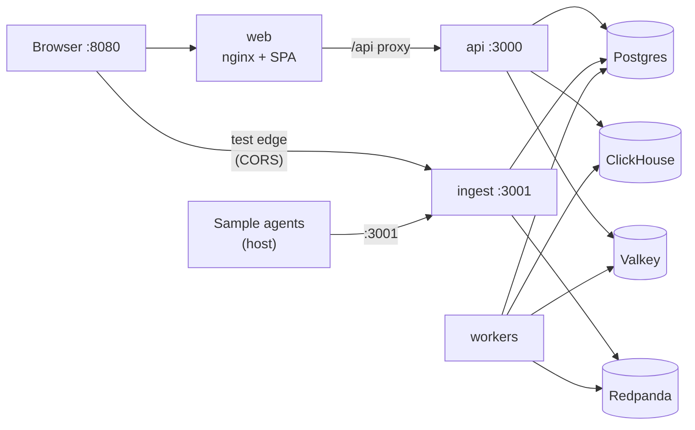

# Deployment guide

Run the **entire blamr stack** — Postgres, ClickHouse, Redpanda, Valkey, API, ingest, workers, and dashboard — with Docker Compose. No local Node install required for the platform itself (sample agents still run on your host).

For all installation paths (SDK, MCP, adapters), see [INSTALL.md](./INSTALL.md).

For day-to-day ops after deploy, see [OPERATIONS.md](./OPERATIONS.md).

---

## Prerequisites

| Requirement | Notes |
|-------------|-------|
| **Docker** 24+ | [Install Docker](https://docs.docker.com/get-docker/) |
| **Docker Compose** v2 | Bundled with Docker Desktop |
| **4 GB RAM** minimum | Redpanda + ClickHouse + Node services |
| **6+ GB RAM** recommended | Ollama + stack (~3 GB model download on first run) |
| **Ports free** | 3000, 3001, 5432, 6379, 8080, 8123, 9092, 19092 — stop local `./scripts/dev-backend.sh` and `npm run dev:web` if already running |

- Node.js 20+ (for sample agents on your host)

---

## Quick start (one command)

```bash
git clone https://github.com/blamr-ai/blamr && cd blamr
cp .env.docker.example .env
./scripts/docker-up.sh
```

Or manually:

```bash
docker compose up --build -d
```

When containers are healthy:

| Service | URL |
|---------|-----|
| **Dashboard** | http://localhost:8080 |
| **API** | http://localhost:3000 |
| **Ingest** | http://localhost:3001 |

---

## First-run setup

### 1. Register and connect (dashboard wizard)

1. Open http://localhost:8080
2. Create an account and workspace — the **connection wizard** opens automatically
3. **Step 1** — Create an ingest API key (`ingest:write`) or paste a key from your admin
4. **Step 2** — Copy the `.env` block (`BLAMR_API_KEY` + `BLAMR_ENDPOINT`). The endpoint must be **ingest** (`http://localhost:3001/v1`), not the dashboard API on port 3000
5. **Step 3** — Click **Send test connection**. The browser POSTs one test edge directly to ingest (CORS enabled) and completes the run — no local agents or Ollama required
6. **Step 4** — Open the test run on Overview or go to **Connect agents** for SDK/MCP snippets

The wizard reopens from **Overview** (empty state) or **Settings** until you complete a test edge or choose **I'll connect later**. Key creation in **Settings → API & keys** also offers **Copy .env block** and **Test connection**.

**CLI equivalent:**

```bash
cp samples/agents/.env.example samples/agents/.env
# add BLAMR_API_KEY and BLAMR_ENDPOINT
./scripts/verify-agent-connection.sh samples/agents/.env
```

### 2. Run sample agents from your host (optional)

The platform runs in Docker; agents connect to published host ports.

```bash
npm install   # repo root (for monorepo tooling)
cp samples/agents/.env.example samples/agents/.env
```

Edit `samples/agents/.env`:

```bash
BLAMR_API_KEY=bk_live_...          # from dashboard
BLAMR_ENDPOINT=http://localhost:3001/v1
BLAMR_LLM_BASE_URL=http://localhost:11434/v1
```

Run a workflow:

```bash
./scripts/run-workflow.sh support
```

Open **Runs** in the dashboard. A run should appear within ~10 seconds of `completeRun`.

### 3. Verify workers

Workers are **required**. Without them, ingest returns `202` but runs never finalize.

```bash
docker compose logs workers --tail 50
```

Look for Kafka consumer groups joining: `clickhouse-writer`, `blame-processor`, `run-aggregator`.

---

## Architecture (Docker network)



**Traffic split:**

| Client | Target | Purpose |
|--------|--------|---------|
| Browser → web | `:8080` | Dashboard SPA |
| Browser → API | `:3000` (or `/api` proxy) | Auth, runs, metrics, live SSE |
| Browser → ingest | `:3001` | Connection wizard test edge only |
| Agents → ingest | `:3001/v1` | Production telemetry |
| Agents → API | — | **Do not use** for edge emit |

**Internal hostnames** (container-to-container): `postgres`, `clickhouse`, `redpanda`, `valkey`, `api`, `ingest`.

**Host-facing URLs** (browser and SDK on your machine): `localhost:3000`, `localhost:3001`, `localhost:8080`.

The web image bakes `VITE_API_BASE_URL` and `VITE_INGEST_URL` at **build time** into `apps/web/src/config.ts`. These drive the connection wizard, Connect page snippets, and Settings key reveal — not hardcoded localhost in the SPA. Defaults target `localhost` so the browser can reach API/ingest from your machine. Nginx also proxies `/api/` → `api:3000` for same-origin API calls when configured in the SPA.

---

## Environment variables

Copy `.env.docker.example` to `.env` in the repo root. Compose reads it automatically.

### Required for production

| Variable | Default (dev) | Description |
|----------|---------------|-------------|
| `JWT_SECRET` | `dev-secret-change-in-production` | Session signing — use a long random string |
| `BLAMR_INGEST_SECRET` | `dev-ingest-secret` | Merkle chain signing for ingest |

### Workers (recommended)

| Variable | Default | Description |
|----------|---------|-------------|
| `BLAMR_ML_ENABLED` | `true` | ML drift classification + root-cause ranker |
| `BLAMR_SEMANTIC_DRIFT` | `true` | Embedding-based intent drift |
| `BLAMR_LLM_BLAME_REASON` | `true` | Human-readable blame explanations |
| `BLAMR_LLM_BASE_URL` | `http://ollama:11434/v1` | Ollama OpenAI-compatible API |
| `BLAMR_LLM_API_KEY` | `local` | Auth token (Ollama accepts any value) |
| `BLAMR_EMBEDDING_MODEL` | `nomic-embed-text` | Embedding model for semantic drift |
| `BLAMR_LLM_REASON_MODEL` | `llama3.2:3b` | Chat model for blame reasons |

Ollama is included in the default Docker stack and pulls models on first boot via `ollama-init`.

### Web build args

Rebuild the web image after changing these:

| Variable | Default | Description |
|----------|---------|-------------|
| `VITE_API_BASE_URL` | `http://localhost:3000` | API URL in browser |
| `VITE_INGEST_URL` | `http://localhost:3001` | Ingest base URL (no `/v1`) — used by connection wizard, Connect page, Settings |

These are read at build time by `apps/web/src/config.ts` as `INGEST_ENDPOINT = ${VITE_INGEST_URL}/v1`. If the dashboard shows the wrong ingest host after deploy, rebuild the web image with updated build args.

For a custom domain behind a reverse proxy, set these to your public URLs and rebuild:

```bash
VITE_API_BASE_URL=https://api.example.com \
VITE_INGEST_URL=https://ingest.example.com \
docker compose up --build -d web
```

---

## Services reference

| Container | Image / build | Port(s) | Role |
|-----------|---------------|---------|------|
| `postgres` | postgres:16-alpine | 5432 | Users, runs, blame reports |
| `clickhouse` | clickhouse-server:24 | 8123, 9000 | Causal edge storage |
| `clickhouse-init` | curl (one-shot) | — | Applies `001_init.sql` |
| `redpanda` | redpanda:v24.1.1 | 9092, 19092 | Kafka-compatible event bus |
| `valkey` | valkey:8 | 6379 | API key cache, embedding cache |
| `api` | `apps/api/Dockerfile` | 3000 | REST API + auth |
| `ingest` | `apps/ingest/Dockerfile` | 3001 | Agent edge ingest |
| `workers` | `apps/workers/Dockerfile` | — | ClickHouse writer, blame, drift |
| `web` | `apps/web/Dockerfile` | 8080 | Dashboard (nginx + SPA; connection wizard, live feed, Connect page) |
| `ollama` | ollama:latest | 11434 | Local SLM (embeddings + chat) |
| `ollama-init` | curl (one-shot) | — | Pulls `nomic-embed-text` + `llama3.2:3b` |

### Optional profiles

```bash
# Ollama — embeddings + chat (default stack)
docker compose up -d

# Rust gRPC blame engine (experimental)
docker compose --profile blame-engine up -d

# Traefik gateway on :80
docker compose --profile gateway up -d
```

---

## Common operations

### View logs

```bash
docker compose logs -f api ingest workers
```

### Restart workers after env change

```bash
docker compose up -d workers
```

### Rebuild after code changes

```bash
docker compose up --build -d
```

### Stop and remove containers (keep data)

```bash
docker compose down
```

### Stop and wipe volumes (fresh database)

```bash
docker compose down -v
./scripts/docker-up.sh
```

### ClickHouse schema only

Schema is applied automatically by `clickhouse-init` on first boot (via `scripts/docker-init-clickhouse.sh`). To re-apply manually:

```bash
./scripts/docker-init-clickhouse.sh   # from host (CLICKHOUSE_URL=http://localhost:8123)
```

---

## Production checklist

1. **Secrets** — Set strong `JWT_SECRET` and `BLAMR_INGEST_SECRET`; never commit `.env`.
2. **Workers** — Must run continuously with `restart: unless-stopped` (already set in compose).
3. **Ollama** — Included in Docker stack; ensure `ollama-init` completed before heavy worker load.
4. **Backups** — Back up Postgres (`pgdata` volume) and ClickHouse (`chdata` volume).
5. **TLS** — Terminate HTTPS at a reverse proxy (nginx, Caddy, cloud LB). Point `VITE_*` URLs at public HTTPS endpoints and rebuild `web`.
6. **TypeORM** — API uses `synchronize: true` for schema auto-migration. For strict production control, disable synchronize and add explicit migrations.
7. **Monitoring** — Confirm workers joined consumer groups; run a sample workflow after every deploy.
8. **Resource limits** — Set Docker memory/CPU limits for Redpanda and ClickHouse in production.

See [OPERATIONS.md](./OPERATIONS.md) for symptom → cause troubleshooting.

---

## Kubernetes / Helm

Full Helm chart: [`deploy/helm/`](../deploy/helm/) — deploys API, ingest, workers, web, ClickHouse, Redpanda, Ollama, Postgres (Bitnami), and Valkey.

```bash
cd deploy/helm
helm dependency update
helm install blamr . -n blamr --create-namespace \
  --set secrets.jwtSecret="$(openssl rand -hex 32)" \
  --set secrets.ingestSecret="$(openssl rand -hex 24)"
```

See **[deploy/helm/README.md](../deploy/helm/README.md)** for image build, ingress, external databases, and troubleshooting.

Validate locally:

```bash
./scripts/helm-lint.sh
```

---

## Local dev vs Docker full stack

| Mode | Use when |
|------|----------|
| **Infra only** (`docker compose up -d postgres clickhouse redpanda valkey` + `./scripts/dev-backend.sh`) | Active development with hot reload |
| **Full Docker** (`./scripts/docker-up.sh`) | Demo, CI, production-like testing, no local Node for platform |
| **Kubernetes** (`deploy/helm/`) | Production cluster with ingress and PVCs |
| **Hybrid** | Platform in Docker/K8s, agents on host (recommended for samples) |

---

## Troubleshooting

| Symptom | Fix |
|---------|-----|
| Dashboard empty after workflow | Check `docker compose logs workers`; workers must be running |
| Dashboard empty after **Test connection** | Ingest returned `202` but workers did not finalize — check workers |
| **Test connection** fails in browser | Rebuild web with correct `VITE_INGEST_URL`; ensure ingest CORS and port reachable from browser |
| Agents connected but no runs | Wrong `BLAMR_ENDPOINT` — must be ingest `:3001/v1`, not API `:3000` |
| `connection refused` on :3001 from host | Wait for ingest healthcheck; `docker compose ps` |
| Port already in use on 3000/3001/8080 | Stop local dev (`dev-backend.sh`, `npm run dev:web`) before `docker compose up` |
| ClickHouse errors on first boot | `docker compose logs clickhouse-init`; re-run init SQL manually |
| Web shows wrong API URL | Update `VITE_*` in `.env` and `docker compose up --build -d web` |
| Redpanda not healthy | Increase Docker memory; check `docker compose logs redpanda` |
| ML errors in workers | Ensure `packages/ml/models/blamr-ml-bundle.json` is in the image (built via `@blamr/ml`) |

Build failures:

```bash
docker compose build --no-cache api ingest workers web
```

Ensure Docker has enough disk space — monorepo builds copy `package-lock.json` and run `npm ci` per service.
